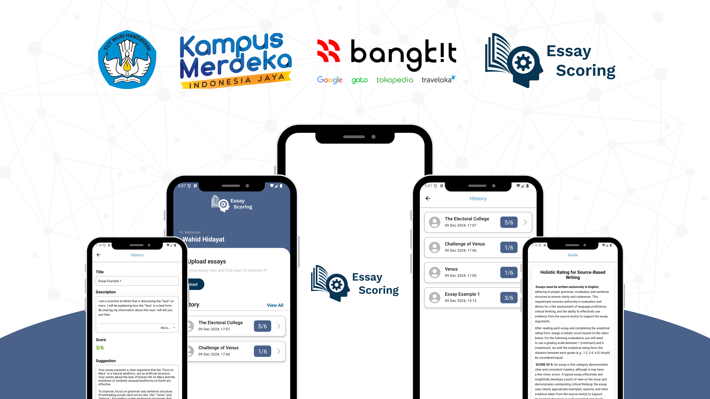
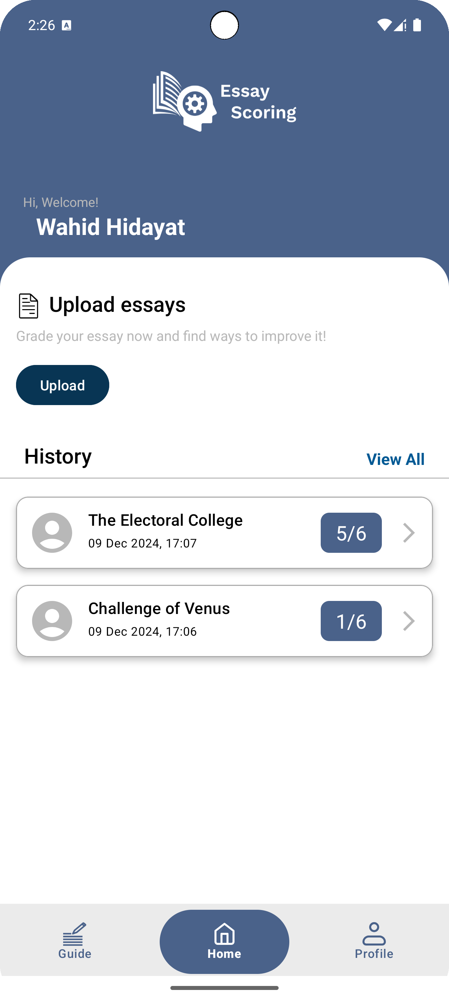
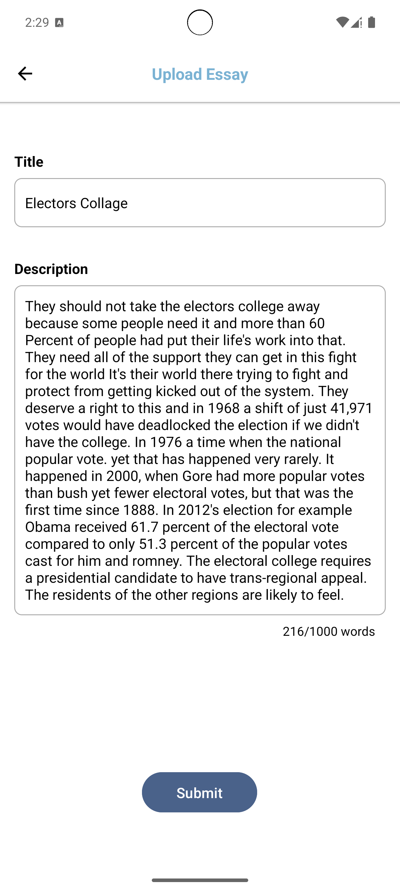
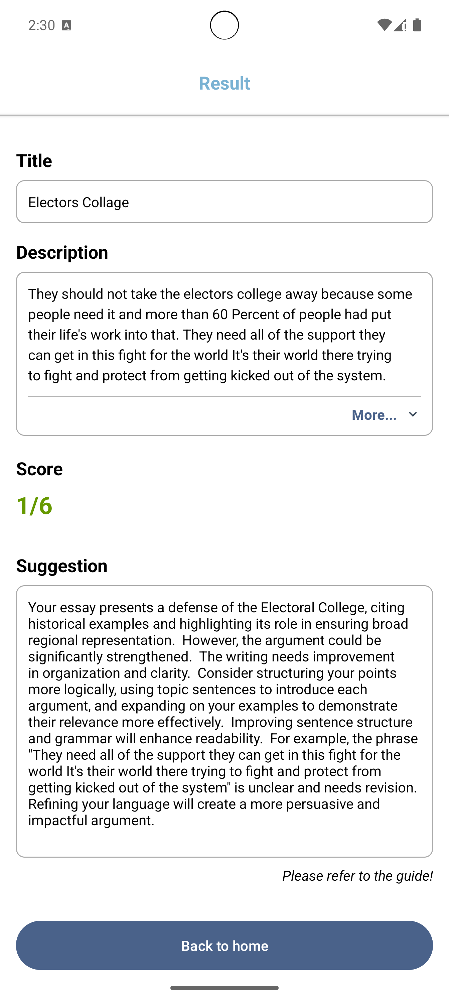
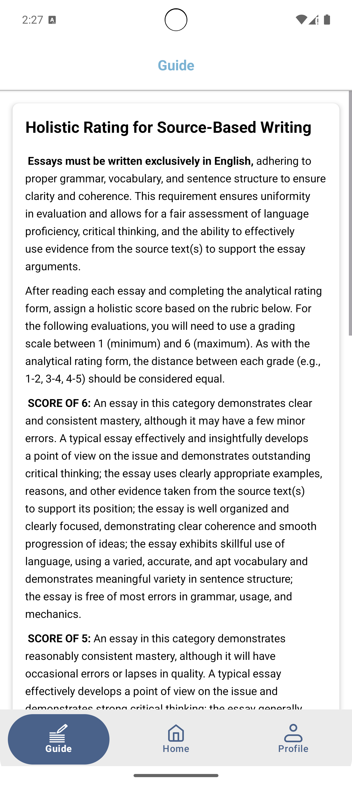
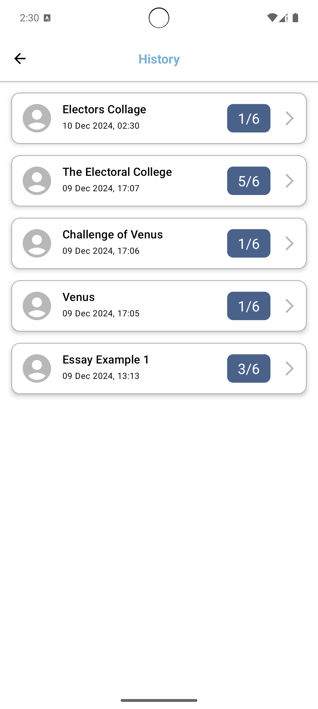
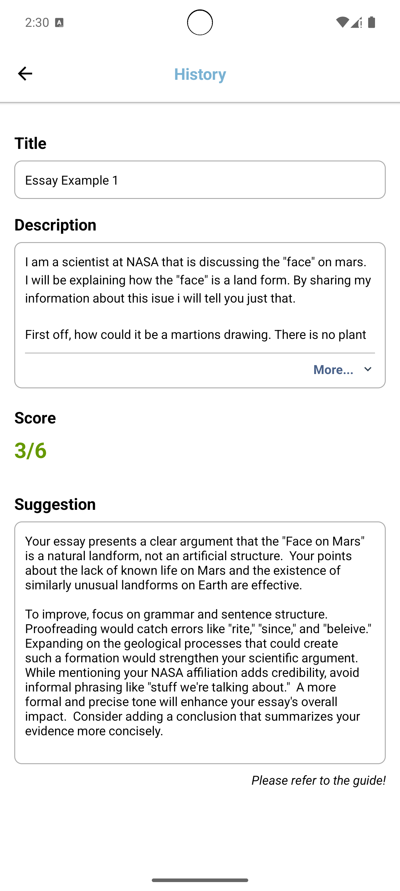

# EsCore: Automated Essay Scoring with AI for Objective and Effective Assessment

**EsCore** is an innovative application leveraging Artificial Intelligence to transform essay grading. It empowers educators with tools to evaluate essays objectively, consistently, and efficiently, enhancing the grading process and supporting improved learning outcomes.

---

## 🌟 Key Features

### 1. Objective, Consistent, and Time-Saving Grading System
Harness the power of AI to deliver precise and impartial essay evaluations, reducing grading time without compromising accuracy.

  
  
  

---

### 2. Suggestion Feature
Provides actionable feedback to help educators and students improve essay quality. This feature drives better learning outcomes by offering constructive and targeted guidance.

  
  

---

### 3. History Feature
Simplifies access to previously assessed essays, enabling users to maintain and review essay records effortlessly.

  
  

---

## 📱 Installation

1. Navigate to the **Releases** section of the repository.
2. Download the latest APK file.
3. Install the application on your Android device.
4. Start revolutionizing your essay grading process!

---

## 💡 About the Project

**EsCore** was developed as a capstone project to address inefficiencies in traditional essay grading methods. It represents a collaborative effort to harness technology for educational improvement.

For questions, feedback, or collaboration opportunities, feel free to reach out!

---

**Thank you for exploring EsCore. Together, we can reshape education through technology.**